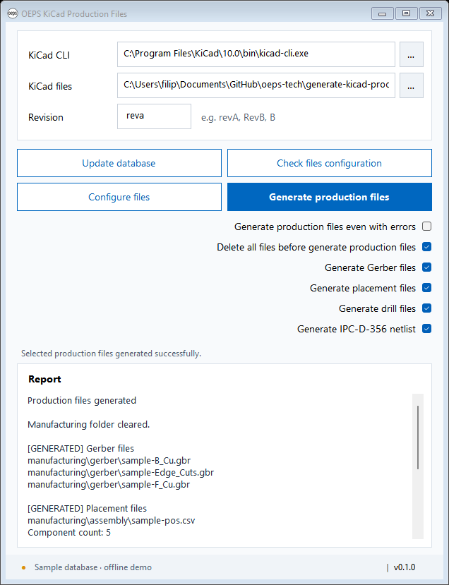

# OEPS KiCad Production Files

Windows desktop infrastructure for checking and exporting KiCad production files. The interface follows `raw-material-sticker`: the same OEPS icon, Segoe UI font, colors, field borders, footer, and **620-pixel default client width**. The default height is 790 pixels; the window can be resized and remembers its size, position, paths and revision.



## Current behavior

Enter or browse for `kicad-cli.exe` and the **project folder** containing the main `.kicad_sch` schematic and `.kicad_pcb` board. The newest KiCad CLI in the standard Windows installation location is detected when no CLI preference has been saved.

Enter the expected **Revision** below KiCad files, for example `revA`, `RevB`, or `B`. Paths and revision are saved between sessions. Changing any entry requires a fresh configuration check.

| Button | Available now |
| --- | --- |
| Update database | Downloads the shared OEPS spreadsheet, validates it, and saves a local CSV cache. |
| Check files configuration | Checks Symbol Fields Table fields, Edit tab metadata, export configuration, field order, revision, and the main PCB's Gerber plot settings. |
| Configure files | Rechecks the project and offers a separate Yes/No confirmation for each repairable failed check, then saves approved fixes and rechecks the result. |
| Generate production files | Optionally clears manufacturing, then exports the selected Gerbers, placement CSV, drill files/maps and IPC-D-356 netlist using KiCad CLI. |

The report is selectable, scrollable text, with a separate header for each check. Configuration checks run away from the GUI thread and do not require the CLI or component database. Save changes in KiCad before checking: the app reads the saved project file.

Configure files and Generate production files start disabled. Changing either the KiCad CLI or KiCad files path resets both buttons. Pressing Check files configuration enables Configure files; completing the checks without errors enables Generate production files. A new check clears the previous successful result until it finishes.

Generation options are stacked on the right between the buttons and report, with each label followed by its checkbox and all checkboxes sharing the same right edge. **Generate production files even with errors** starts unchecked. **Delete all files before generate production files**, **Generate Gerber files**, **Generate placement files**, **Generate drill files**, and **Generate IPC-D-356 netlist** start checked each time the app opens. At least one file type must be selected. The override permits generation before a check or after a failed check; generation waits while a check, configuration fix or export is running. Options and inputs are locked during those operations. Database refreshes preserve the current check result.

### Symbol Fields Table

The check reads `schematic.bom_settings.fields_ordered` in the single `.kicad_pro` file directly inside the selected folder. Fields are identified by `name`; Included is stored as `show` and Group By as `group_by`.

| Field | Included | Group By |
| --- | --- | --- |
| Reference | Required | Optional |
| Value | Required | Required |
| Footprint | Required | Required |
| `${QUANTITY}` | Required | Optional |
| `${ITEM_NUMBER}` | Required | Optional |
| LCSC | Required if present | Required if present |
| MPN | Required | Required |
| OEPS Description | Required | Required |
| OEPS PN or OEPSPN | Required | Required |
| Temp. Co. or TempCo or Temp Co | Required | Required |
| Tolerance | Required | Required |
| Voltage | Required | Required |
| `${DNP}` | Required | Required |

KiCad saves Item Number as `${ITEM_NUMBER}` with an underscore. Aliases are matched exactly; when multiple accepted aliases are present, each present field is checked. LCSC may be absent from the saved field list. Column order and the global `group_symbols` option have their own checks below. Passing results show only the `[PASSED] Symbol Fields Table` header; failures list every correction needed.

### Edit Tab metadata

A separate check reads the following values from `schematic.bom_settings` and reports them under **Edit Tab metadata**:

| Edit tab option | Required saved setting |
| --- | --- |
| Group symbols selected | `group_symbols: true` |
| Include 'DNP' Symbols selected | `exclude_dnp: false` |
| Include 'Exclude from BOM' Symbols cleared | `include_excluded_from_bom: false` |
| Ascending sort | `sort_asc: true` |
| Sort field Reference | `sort_field: "Reference"` |

All five settings must be present with the correct JSON types and values. The check lists every required correction; it does not modify the project. Reports omit timestamps and project paths.

### Export configuration

The **Export configuration** check requires `schematic.bom_export_filename` to be exactly `manufacturing/bom/${PROJECTNAME}.csv`. The project variable stays literal in the saved configuration.

It also checks `schematic.bom_fmt_settings`:

| Setting | Required value |
| --- | --- |
| `field_delimiter` | Comma (`,`) |
| `string_delimiter` | One double quote (`"`) |
| `ref_delimiter` | Comma (`,`) |
| `ref_range_delimiter` | Empty string |
| `keep_tabs` | `false` |
| `keep_line_breaks` | `false` |

Missing, duplicated or incorrect settings are reported. Passing checks show only their `[PASSED]` header; failed checks list the corrections. This check reads the saved configuration and does not generate a BOM or modify the project.

### Field order

The **Field order** check requires this sequence of included columns in `schematic.bom_settings.fields_ordered`:

```text
# → Qty → Reference → Value → Tolerance → Footprint → TempCo → Voltage → DNP → OEPS PN → MPN → LCSC → OEPS Description
```

If LCSC is absent from the saved field list, its slot is omitted. Hidden extra fields are ignored. Additional included columns, missing or hidden required columns, and columns in the wrong position fail this check. Accepted temperature and OEPS PN aliases use the same slots. The check identifies `#`, `Qty` and `DNP` using their KiCad field names `${ITEM_NUMBER}`, `${QUANTITY}` and `${DNP}`; export labels are not renamed or validated.

Passing results show only `[PASSED] Field order`. Failures show the expected and actual sequences.

## Revision check

The **Revision** check compares the entry in the GUI with both `board.ipc2581.sch_revision` in the `.kicad_pro` file and `(rev "...")` in the root `(title_block ...)` of the main `.kicad_sch`. The main schematic must have the same filename stem as the project, for example `main.kicad_pro` and `main.kicad_sch`. Surrounding spaces, letter case, and an optional leading `rev` are ignored, so `B`, `RevB`, and `revB` match.

When both values match, the report shows only `[PASSED] Revision`. A missing or different saved revision, an invalid setting, or an empty Revision entry shows `[FAILED] Revision` with the reason and the affected file type. A bare `Rev` prefix is also invalid because it has no revision value. A missing main schematic is reported; other schematics and subsheets are not substituted for it.

Its source is `src/Oeps.KicadProductionFiles.Core/CheckFilesConfiguration/RevisionCheck.cs`.

## Gerber plot settings check

The **Gerber plot settings** check reads `setup/pcbplotparams` in the main `.kicad_pcb` with the same filename stem as the single `.kicad_pro` file. Its source is `CheckFilesConfiguration/GerberPlotSettingsCheck.cs`.

It requires the General and Gerber options shown in the supplied screenshot:

| Saved setting | Required value |
| --- | --- |
| `plotframeref` | `no` |
| `subtractmaskfromsilk` | `yes` |
| `hidednponfab` | `no` |
| `sketchdnponfab`, `crossoutdnponfab` | Both `yes` (Indicate DNP → Cross-out) |
| `sketchpadsonfab`, `plotpadnumbers` | Both `no` |
| `drillshape` | `0` (None) |
| `scaleselection` | `1` (1:1) |
| `useauxorigin` | `yes` |
| `mirror`, `psnegative` | Both `no` |
| `usegerberextensions`, `creategerberjobfile` | Both `no` |
| `gerberprecision` | `6`, or absent because 6 is KiCad's default |
| `usegerberattributes`, `usegerberadvancedattributes` | Both `yes` |
| `disableapertmacros` | `no` |
| `outputdirectory` | `"manufacturing/gerber/"` (quoted, with trailing slash) |

A passing result shows only `[PASSED] Gerber plot settings`. Failures list each missing or incorrect setting and its expected value. This includes the saved values corresponding to disabled screenshot controls and the required output directory `manufacturing/gerber/`. Layer selections, output format and other export-format settings are outside this check.

**Check zone fills before plotting** is a KiCad application preference, not a `pcbplotparams` entry. This PCB check/fix does not change that preference. Gerber generation requests zone checking explicitly with `--check-zones`.

## Configure files

After running Check files configuration, click **Configure files**. It reads the current saved project again and prepares a fix for each failed check. Each confirmation popup identifies the failed check, lists its problems, and describes the proposed change:

- **Yes** applies that fix and saves the project.
- **No** skips that fix and continues to the next one.
- Passing checks do not prompt. Checks are rerun between fixes and at the end, so an already resolved failure is skipped automatically.

Each fix has its own source file in `src/Oeps.KicadProductionFiles.Core/ConfigureFiles/`:

| Source file | Changes |
| --- | --- |
| `SymbolFieldsTableFix.cs` | Adds missing required fields and corrects Included/Group By flags. Preserves existing aliases and labels; does not add absent LCSC. |
| `EditTabMetadataFix.cs` | Corrects grouping, DNP/BOM inclusion and Reference sorting. |
| `ExportConfigurationFix.cs` | Corrects the BOM filename, delimiters and text options. |
| `FieldOrderFix.cs` | Reorders existing required fields and clears Included for extra columns while retaining their settings. |
| `RevisionFix.cs` | Corrects the project revision and main schematic title-block revision under one confirmation, using the entered revision without its optional prefix, in uppercase (for example `B`). Already matching values are retained. Requires a nonempty Revision entry. |
| `GerberPlotSettingsFix.cs` | Repairs the screenshot's saved PCB plot options and sets the output directory to `manufacturing/gerber/`. Adds missing settings/containers, accepts omitted default precision, and preserves other PCB text, including layers. |

Field order requires the required fields to exist and be included. If the Symbol Fields Table fix is declined while those inputs are missing, the order fix reports that dependency; it does not apply the declined field changes. Ambiguous alias columns, duplicate JSON keys, malformed structures, and missing or ambiguous project files are reported for manual correction rather than guessed at.

Approved edits preserve unrelated JSON values and save each changed file in a uniquely named `.bak` file under the project's `.oeps-backups` folder. Each file replacement is atomic. Both revision files are checked for changes before either is saved; if either changed while the confirmation was open, the prepared fix is rejected. If a later replacement fails, the app attempts to restore earlier replacements and reports any recovery problem. Project JSON formatting may be normalized; UTF-8 BOM and newline style are retained. To restore a backup, close the project in KiCad and copy the chosen `.bak` file over its original `.kicad_pro` or `.kicad_sch` file.

The schematic fix replaces only the revision string, preserving the title, company, comments, symbols, wiring and surrounding text. It can add a missing `rev` or `title_block`. Duplicate or malformed title-block revision settings are reported for manual correction.

The final report keeps the check results and lists fixed, skipped, or unsuccessful actions. Save your work in KiCad before configuring files, and reopen the project in KiCad afterward to load the saved settings. Configure files edits `.kicad_pro` settings, the main schematic's title-block revision, and the main PCB's plot options. PCB fixes use the same confirmation, original-file backup and stale-file protection. Duplicate or structured plot values are reported for manual correction.

BOM/position quantity comparisons, OEPS PN/MPN validation, and BOM export remain future implementation steps.

## Generate production files

Click **Generate production files** to export the selected file types. When Gerbers are selected, an OK/Cancel popup first asks you to open the board, make sure zones were filled, validate **Include Layers**, and save the board. Cancel stops the entire operation before cleanup or export. Placement-only and drill-only exports do not show this popup.

The CLI path and support for every selected export are checked before cleanup. If deletion is selected, the app clears the entire contents of the selected project's `manufacturing` folder, including subfolders, once before generation. If it is cleared, unrelated files remain and matching generated filenames are replaced. Selecting no output types disables generation and never clears files. The main board must have the same filename stem as the single `.kicad_pro` file. Save PCB changes in KiCad first; the CLI reads the saved board.

**Gerber files** go to `manufacturing/gerber/`. `GerberFilesGenerator.cs` runs `pcb export gerbers --board-plot-params --check-zones --output <temporary-directory> <board>`, using KiCad's saved board plot settings and layer selection. The default variant is used. KiCad 10 CLI creates an auxiliary Gerber job file even when the board's `creategerberjobfile` is off; the app publishes it only when explicitly enabled in the board. CLI option behavior is documented in the [KiCad 10 CLI manual](https://docs.kicad.org/10.0/en/cli/cli.html).

**Drill files and maps** also go to `manufacturing/gerber/`. `DrillFilesGenerator.cs` uses explicit options: Excellon, inches, decimal coordinates, drill/place origin, separate PTH/NPTH files, routed oval holes (alternate mode off), and Gerber X2 maps. Mirror Y, minimal header and tenting switches are omitted. Its command is `pcb export drill --format excellon --drill-origin plot --excellon-zeros-format decimal --excellon-oval-format route --excellon-units in --excellon-separate-th --generate-map --map-format gerberx2 --output <temporary-directory> <board>`. KiCad's shared `pcbnew.json` preferences are not edited. The former app drill-profile check, fix and initialization have been removed; any old `drill-export-settings.json` is unused.

**IPC-D-356 netlist** goes directly to `manufacturing/<project-name>.d356`. `IpcD356FilesGenerator.cs` runs `pcb export ipcd356 --output <temporary-file> <board>`. It checks that the output exists and includes its header and end marker before publishing it. The new checkbox starts checked; IPC-only generation does not display the Gerber reminder.

The placement generator writes `manufacturing/assembly/<project-name>-pos.csv` with these settings:

| Setting | Value |
| --- | --- |
| Design variant | Default (no variant override) |
| Format / units | CSV / millimeters |
| Board sides | Front and back in one file |
| Include only SMD | False |
| Exclude footprints with through-hole pads | False |
| Exclude DNP | False |
| Exclude from BOM filter | False |
| Use drill/place origin | True |
| Negate bottom X | False |

The CLI invocation is `pcb export pos --format csv --units mm --side both --use-drill-file-origin --output <csv> <board>`. Exclusion and negative-X switches are omitted.

The report lists each generated file under its export's header, with component count for placements, or reports the CLI error. Each exporter writes to an empty temporary directory first, validates the output, then publishes it. Basic format checks detect missing, empty or truncated Gerbers, incorrect Excellon units/zero format, missing PTH/NPTH files/maps, and invalid placement CSV headers. These checks do not validate manufacturing correctness or board geometry. Failed CLI exports cannot pass using stale files or replace existing output. Errors report whether manufacturing was already cleared. Cleanup is confined to the selected project's `manufacturing` directory and refuses linked paths. Other project files and `.oeps-backups` are retained.

Each generation has its own source file under `src/Oeps.KicadProductionFiles.Core/GenerateProductionFiles/`: **`GerberFilesGenerator.cs`**, **`PlacementFilesGenerator.cs`**, **`DrillFilesGenerator.cs`**, and **`IpcD356FilesGenerator.cs`**. `ProductionGenerationRunner.cs` selects generators and handles optional cleanup once before the sequence. `ExportOutputDirectory.cs` handles temporary outputs, validation and publication.

## Run from this checkout

Double-click **`Run.cmd`**. It builds and opens the app using .NET 10. It finds a local `.tools/dotnet` SDK, the existing SDK in the sibling `raw-material-sticker` folder, or an SDK on `PATH`.

For the already downloaded development cache:

```bat
Run.cmd --data-dir .local/data
```

For an offline UI demonstration with clearly labeled sample data:

```bat
Run.cmd --sample --data-dir .local/demo
```

## Shared component database

The app uses the same Google spreadsheet and `components list` tab as `raw-material-sticker`. It selects column A (description), B (OEPS PN), and D (MPN). Part numbers remain strings, including leading zeros. Multiple valid MPNs for one OEPS PN remain separate pairings.

- The CSV is refreshed every **five minutes** while the app is open; the button forces an immediate refresh.
- Startup loads the last valid cache and refreshes it if due.
- Invalid downloads, offline connections, or timeouts retain the last valid CSV and display the refresh failure.
- Downloads have a 40-second deadline and a 20 MiB limit. A validated CSV replaces the old file atomically.
- The footer shows sync status and the countdown to the next attempt; hover for cache details and errors.

Normal application data is stored separately from the sticker app:

```text
%LOCALAPPDATA%\OEPS\KicadProductionFiles\
  components.csv
  user-settings.json
  appsettings.json       (optional configuration overrides)
```

`--data-dir` changes the data directory for source runs or diagnostics. A verified live CSV is also saved in this checkout at `.local/data/components.csv` (ignored by Git). Live CSV data and user settings are excluded from release packages.

Packaged `appsettings.json` contains the spreadsheet URL, header aliases, and release repository. An `appsettings.json` in the data directory overrides individual values. See `config.example.json` for the available settings.

## Launcher, installer, and updates

The launcher and installer follow the sticker app's model, using this application's own name, shortcuts, data directory, and `oeps-tech/generate-kicad-production-files` release repository.

Build the installer and application update ZIPs:

```powershell
powershell -NoProfile -ExecutionPolicy Bypass -File scripts/package.ps1
```

The script builds the solution, runs the console verification suite, and writes versioned ZIPs plus SHA-256 files under `artifacts/`. Existing versioned artifacts are protected from accidental replacement.

To install, extract `Oeps.KicadProductionFiles-0.1.0-setup-win-x64.zip` and run its `Install.cmd`. It creates desktop and Start-menu shortcuts. The bootstrap checks for the .NET 10 Desktop runtime and offers a verified per-user runtime download if required. No SDK is needed for the packaged application.

The desktop shortcut starts the updater. Updates are checked against stable GitHub releases, validated using checksums and package metadata, and promoted only after the new app signals readiness. The installed/previous version remains available for fallback. The GUI also checks for an available update every 30 minutes and explains how to apply it via the shortcut. Source `Run.cmd` opens the development build directly.

The repository is currently private. Release downloads require repository access; the current updater cannot discover private releases because it uses unauthenticated requests. Use the full setup ZIP for installation and manual updates while it remains private. See [v0.1.0 release notes](docs/releases/v0.1.0.md), including the KiCad IPC-D-356 via-field issue and recommended KiCad version.

The included GitHub workflow builds and verifies pushes/PRs. Pushing a stable `vX.Y.Z` tag publishes the matching release artifacts. No release is published merely by building locally.

## Extending the workflows

```text
src/
  Oeps.KicadProductionFiles.App/       Windows Forms UI and action wiring
  Oeps.KicadProductionFiles.Core/
    Configuration/                   Paths, settings and configuration
    Data/                            Spreadsheet parsing and CSV cache
    Kicad/                           Project settings reader and CLI execution
    CheckFilesConfiguration/         One source file per configuration check
    ConfigureFiles/                  One source file per fix, confirmation workflow and project saving
    GenerateProductionFiles/         One source file per generator and shared manufacturing cleanup
    Checks/                          Shared reports and future production checks
    Updates/                         Release download and recovery
  Oeps.KicadProductionFiles.Launcher/ Startup and update orchestration
tests/Oeps.KicadProductionFiles.Tests/
```

Each file check implements `IFileCheck` and returns a named `CheckResult` with status and detail. The button's checks belong in `Core/CheckFilesConfiguration/`: `SymbolFieldsTableCheck.cs` checks the fields, `EditTabMetadataCheck.cs` checks the Edit tab options, `ExportConfigurationCheck.cs` checks the output filename and format, `FieldOrderCheck.cs` checks the included column sequence, and `RevisionCheck.cs` checks the saved revision against the GUI entry. `ConfigurationCheckRunner.cs` registers them. Add future configuration tests as separate source files and register them there.

The earlier setup/production check infrastructure remains available in `Core/Checks/` for later workflows:

- `KicadCliCheck.cs`
- `ProjectFilesCheck.cs`
- `ComponentDatabaseCheck.cs`
- `BomPositionCountCheck.cs` (pending comparison policy)
- `ComponentIdentifiersCheck.cs` (pending validation policy)

The configuration button reports a missing or ambiguous project when the selected folder contains zero or multiple `.kicad_pro` files. BOM/position comparison, identifier validation, and additional production generators remain future workflow steps.

## Verification

With .NET 10 on `PATH` (or substitute the SDK found by `Run.cmd`):

```powershell
dotnet build Oeps.KicadProductionFiles.sln -c Release
dotnet run --project tests/Oeps.KicadProductionFiles.Tests -c Release
dotnet run --project tests/Oeps.KicadProductionFiles.Tests -c Release -- --verify-live .local/data
dotnet run --project tests/Oeps.KicadProductionFiles.Tests -c Release -- --verify-configuration "kicad to work on"
Run.cmd --sample --ui-smoke --data-dir .local/ui-smoke
```

The tests use a dependency-free console harness, so use `dotnet run` for verification. Live verification accesses the shared spreadsheet. UI smoke uses sample data, runs hidden, records its results and a screenshot, and exits. See `docs/verification-results.md` for the checks completed on this implementation.
